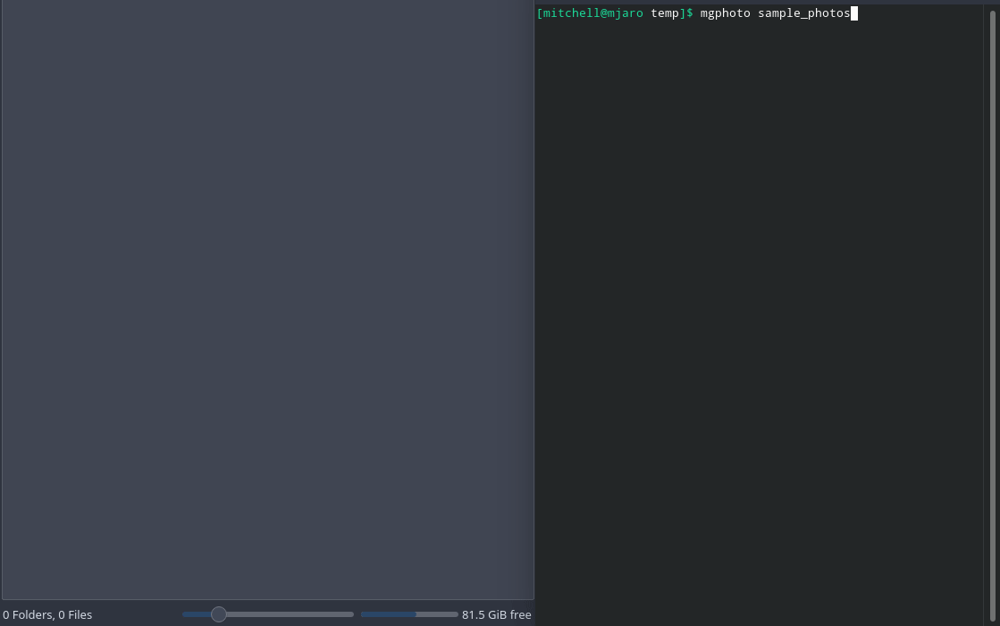

<p align="center">

<h2 align="center">A dead simple command line photo import tool</h2>
</p>
<br>
<p align="center">
    
</p>
<br>

<p align="center">
    <a href="https://github.com/mgerb/mgphoto/releases">Download the latest release here</a>
</p>

- extremely fast
- duplicate file handling
  - skip duplicates
  - copy duplicates to separate folder
- preserve original files and file names
- uses **optional** [Exiftool](https://exiftool.org/install.html) for higher precision exif readings (just install and make sure `exiftool` is in your path to benefit from this)
- Photos are not renamed unless a file already exists with that name e.g. **IMG_1.jpg** will be renamed to **IMG_1_1.jpg**.
- recursively scan directory for new photos

Courtesy of [gophers](https://github.com/egonelbre/gophers) for the logo.

## Options

| Argument | Default | Description
|--|--|--|
| out | ./photos | Output path - defaults to ./photos |
| log | ./transfer.log | Log path - defaults to ./transfer.log |
| copy-dupes  | false | Copy duplicates to 'duplicates' folder |
| ignore-tiny  | false | Ignore really small images (<5kb) |
| dryrun | false | Don't actually do anything |
| analyze | false | Track how long operations are taking |
| sidecar | false | Include sidecar files e.g. .xml, .on1, .xmp |

## Example Usage

```
mgphoto -out=/home/photos -copy-dupes -ignore-tiny -analyze /path/to/input/files
```